# Trabajo Práctico: Arquitectura de Microservicios E-Commerce

**Materia:** Construcción de Aplicaciones Informáticas  
**Institución:** Universidad de Buenos Aires (UBA)  
**Año:** 2026  

##  Integrantes del Grupo
* Christian Gabriel Jackson
* Tomas Ponti
* Tomas Ustimczuk

---

##  Descripción General
Este proyecto implementa un sistema de E-Commerce basado en una arquitectura de microservicios distribuidos. La solución expone 5 REST APIs independientes desarrolladas en **C# con .NET Core 8**, cumpliendo con los contratos de diseño, manejo de excepciones de dominio, y observabilidad exigidos por la cátedra.

##  Arquitectura y Tecnologías
El proyecto fue construido siguiendo estrictas reglas de separación de responsabilidades y buenas prácticas:
* **Framework:** ASP.NET Core 10 (Minimal APIs / Controllers).
* **Persistencia:** Base de datos embebida **SQLite** mapeada a través del micro-ORM **Dapper**. No requiere instalación de servidor externo.
* **Comunicación HTTP:** Implementación de `IHttpClientFactory` para la comunicación segura y eficiente entre microservicios (Ej: Cart -> Products).
* **Manejo de Errores Global:** Ausencia total de bloques `try-catch` en la capa de negocio. Se delega la captura a un `IExceptionHandler` global que formatea las respuestas bajo el estándar **RFC 7231 Problem Details**, utilizando excepciones de dominio (`NotFoundException`, `BusinessRuleException`).
* **Observabilidad:** 
  * Logging estructurado con **Serilog** (Doble Sink: Consola para errores y Archivo `audit.log` para tracking de requests).
  * Monitoreo en tiempo real con **Health Checks** (`/health` y `/health-ui`) .

---

##  Mapeo de Puertos y Servicios
Cada microservicio corre de forma independiente en su propio puerto local:

| Microservicio | Puerto Local | Swagger UI | Health Check UI |
| :--- | :--- | :--- | :--- |
| **Products API** | `7001` | `https://localhost:7001/swagger` | `https://localhost:7001/health-ui` |
| **Users API** | `7002` | `https://localhost:7002/swagger` | `https://localhost:7002/health-ui` |
| **Orders API** | `7003` | `https://localhost:7003/swagger` | `https://localhost:7003/health-ui` |
| **Cart API** | `7004` | `https://localhost:7004/swagger` | `https://localhost:7004/health-ui` |
| **Notifications API** | `7005` | `https://localhost:7005/swagger` | `https://localhost:7005/health-ui` |

---

##  Prerrequisitos
No es necesario instalar motores de bases de datos complejos. El proyecto requiere únicamente:
* **SDK de .NET 10** instalado.
* **Visual Studio** (o IDE compatible).
* Las dependencias de NuGet se restaurarán automáticamente al compilar. Los paquetes principales utilizados son:
  * `Microsoft.Data.Sqlite` y `Dapper`
  * `Serilog.AspNetCore`, `Serilog.Sinks.Console`, `Serilog.Sinks.File`
  * `Swashbuckle.AspNetCore`
  * `AspNetCore.HealthChecks.UI`
  * `IdentityModel` y `KubernetesClient`

---

##  Pasos de Ejecución
La solución está configurada para inicializar y crear las bases de datos `app.db` automáticamente de forma local durante el arranque.

Para probar el flujo completo del E-Commerce (comunicación entre APIs), es necesario levantar los 5 microservicios simultáneamente:

1. Abrir el archivo `ECommerce.sln` con Visual Studio.
2. Hacer clic derecho sobre la Solución (`ECommerce`) en el Explorador de Soluciones y seleccionar **"Propiedades"** (Properties).
3. Ir a la sección **"Proyecto de inicio"** (Startup Project).
4. Seleccionar la opción **"Proyectos de inicio múltiples"** (Multiple startup projects).
5. Cambiar la acción de los 5 proyectos (`Products.API`, `Users.API`, `Orders.API`, `Cart.API`, `Notifications.API`) al valor **"Iniciar"** (Start).
6. Hacer clic en "Aceptar".
7. Presionar **F5** o hacer clic en el botón de **"Iniciar"** en la barra superior.
8. Se abrirán 5 ventanas de consola (Logs de Serilog) y 5 pestañas en tu navegador apuntando a la documentación de Swagger de cada API.

---

##  Diagrama de Arquitectura Lógico

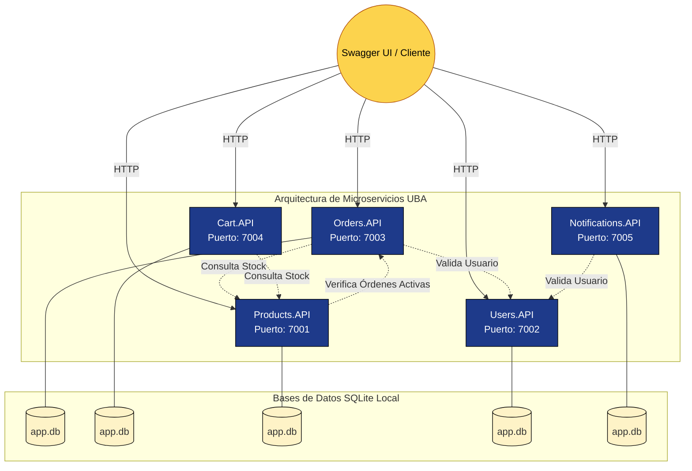

---

## 3. Documentación de Errores (Swagger UI)
A continuación se detallan las capturas de pantalla de las respuestas de error estructuradas con código y mensaje, tal como lo exige el catálogo del dominio.

### Products API

**Error PRD-001 (Producto no encontrado):**
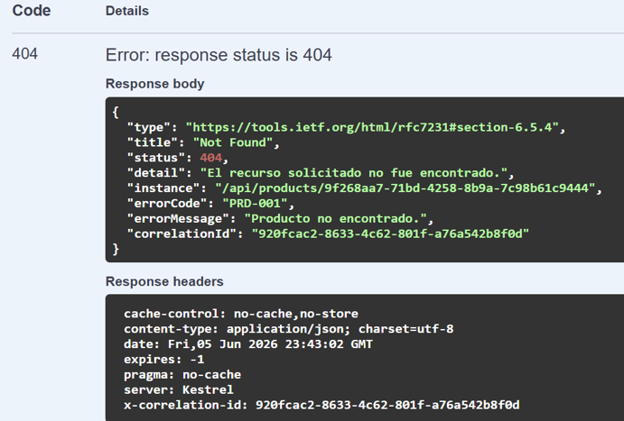

**Error PRD-002 (Los datos del producto son inválidos.):**
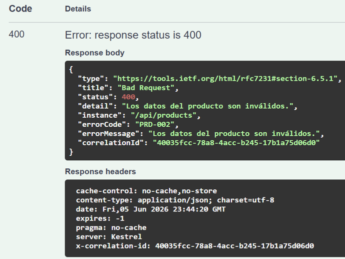

**Error PRD-003 (Ya existe un producto con ese nombre en la categoría.):**
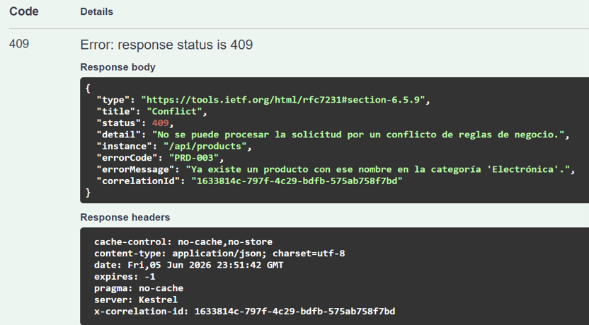

**Error PRD-004 (El producto tiene órdenes activas y no puede eliminarse.):**
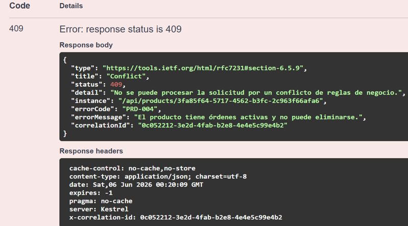

**Error PRD-005 (Error interno del servidor):**
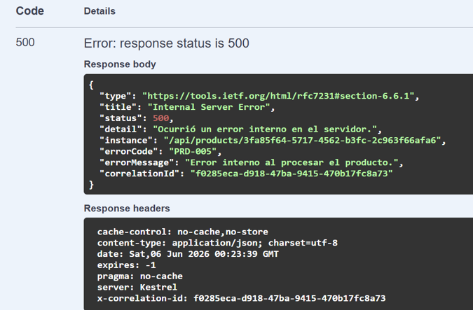

### Users API

**Error USR-001 (Email duplicado):**
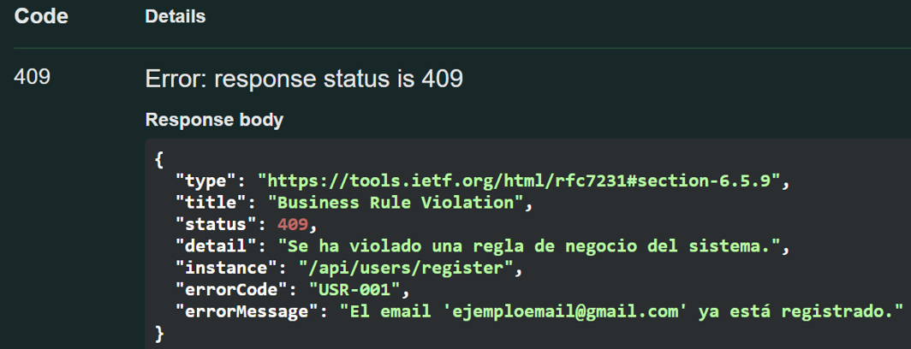

**Error USR-002 (Los datos del usuario son inválidos.):**
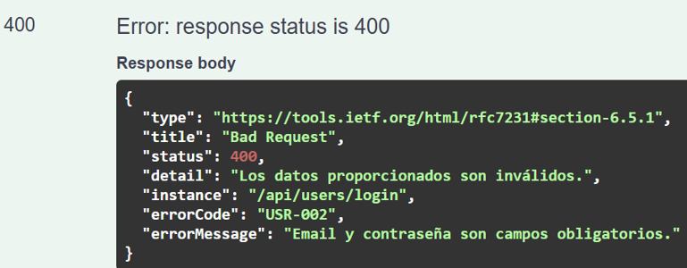

**Error USR-003 (Credenciales incorrectas.):**
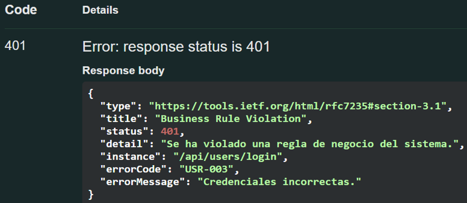

**Error USR-004 (Usuario bloqueado por demasiados intentos fallidos):**
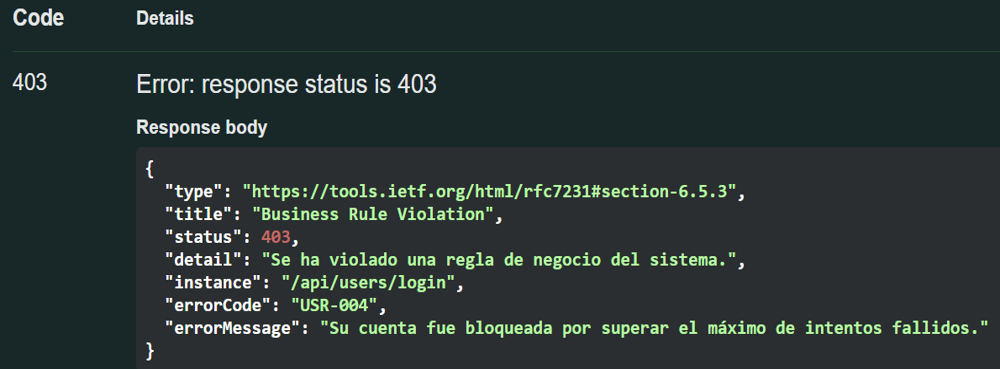

**Error USR-005 (Usuario bloqueado por detección de fraude.):**
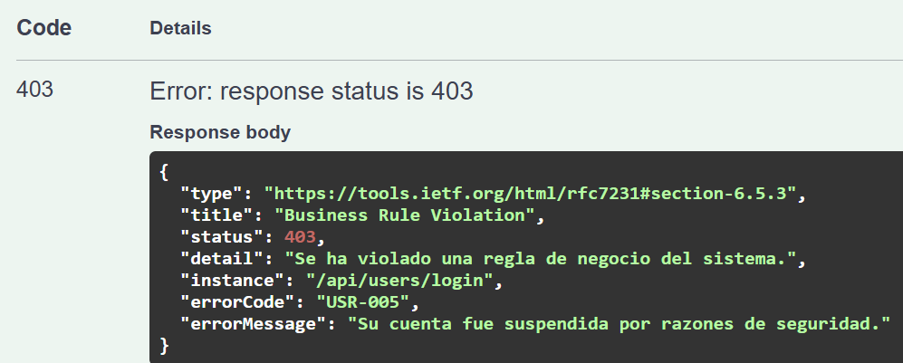

**Error USR-006 (Error interno al procesar el usuario.):**
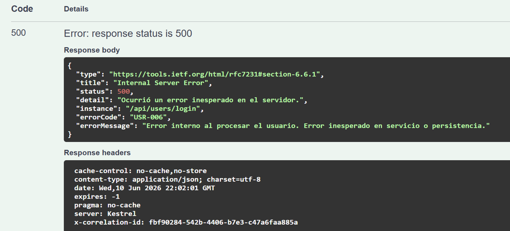

### Orders API

**Error ORD-001 (Orden no encontrada.):**
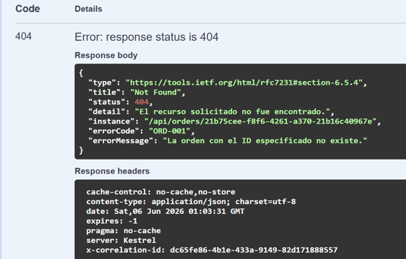

**Error ORD-002 (Los datos de la orden son inválidos.):**
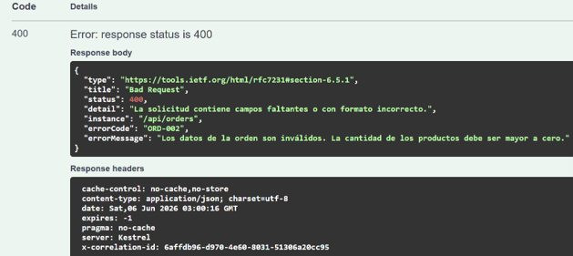

**Error ORD-003 (El usuario especificado no existe o no es válido.):**
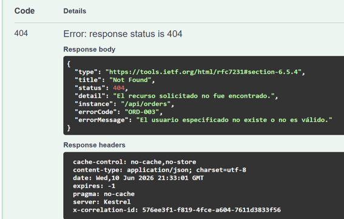

**Error ORD-004 (El producto con ID (id) no existe en el catálogo):**
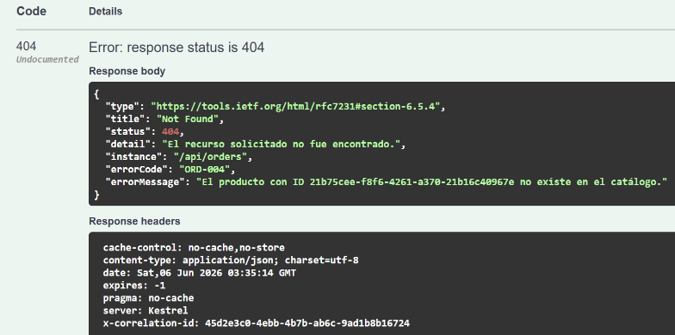

**Error ORD-005 (Stock Insuficiente para el producto (id). Stock actual: (stock).):**
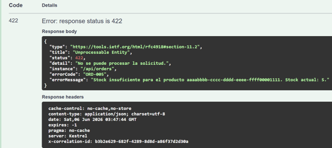

**Error ORD-006 (No se puede modificar el estado de una orden que ya se encuentra en estado Cancelada o Completada.):**
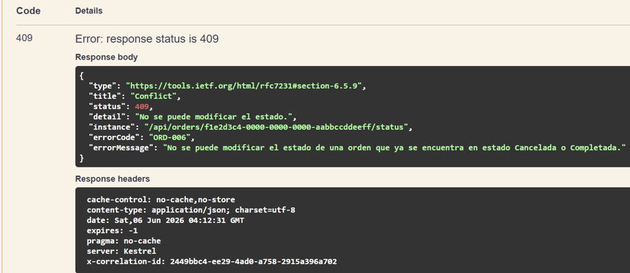

**Error ORD-007 (Error interno inesperado):**
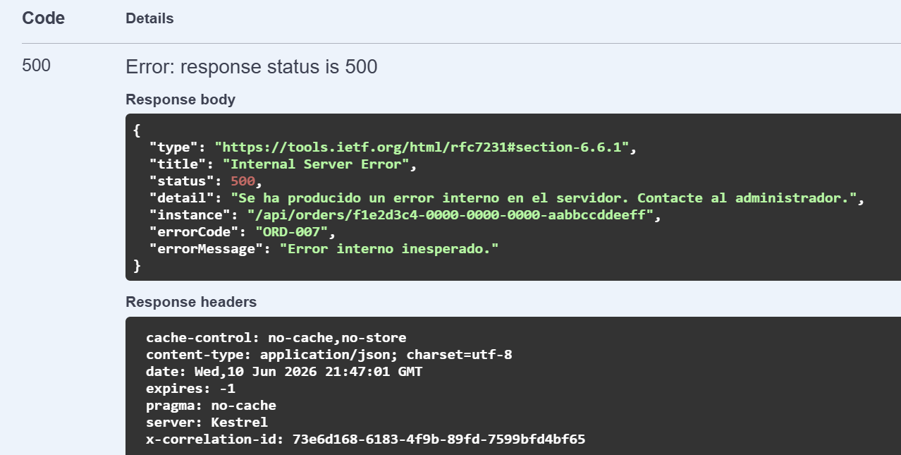

### Cart API

**Error CRT-001 (Carrito no encontrado.):**
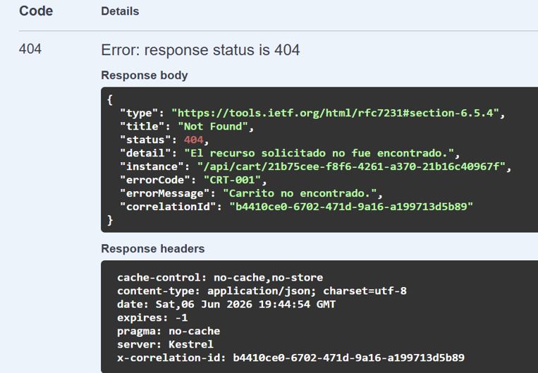

**Error CRT-002 (Producto no encontrado.):**
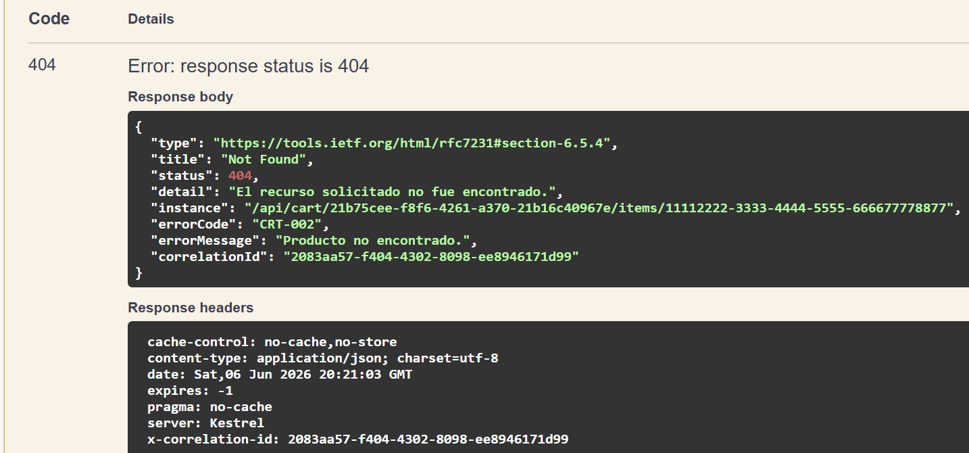

**Error CRT-003 (Stock insuficiente. Disponible: , Solicitado: ):**

**Error CRT-004 (La cantidad debe ser mayor a cero):**
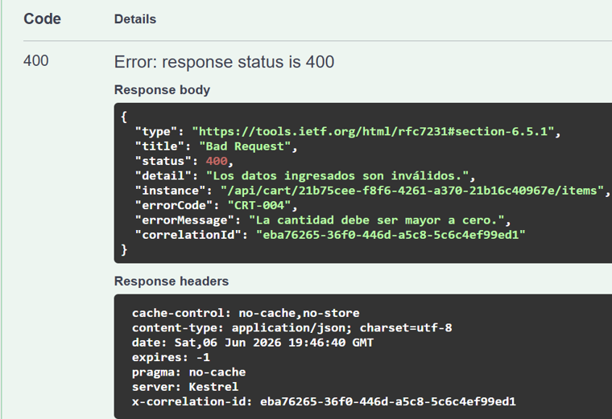

**Error CRT-005 (Error interno al procesar el carrito):**
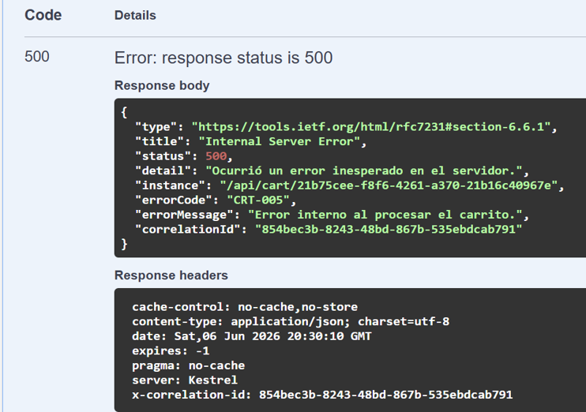

### Notifications API

**Error NTF-001 (El usuario destinatario no fue encontrado):**
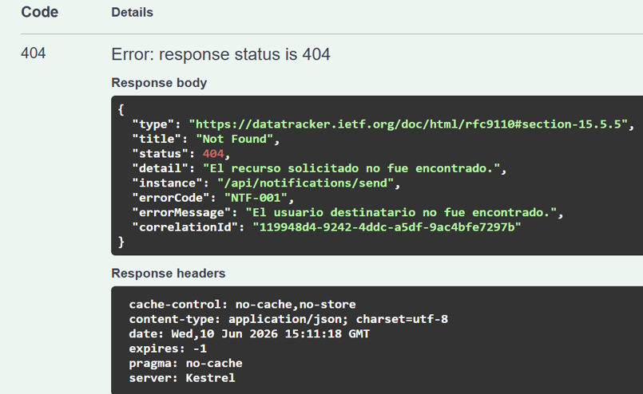

**Error NTF-002 (Los datos de la notificación son inválidos. El tipo no puede estar vacío y debe ser 'Email', 'Push' o 'SMS'.):**
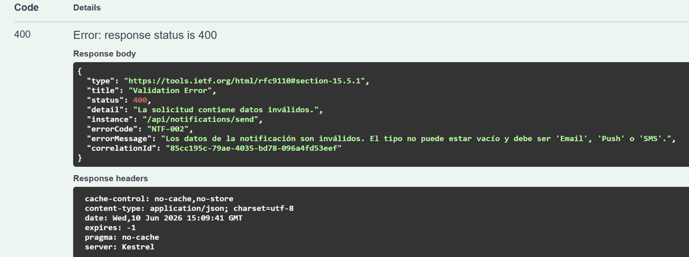

**Error NTF-003 (No se encontraron notificaciones para el usuario.):**
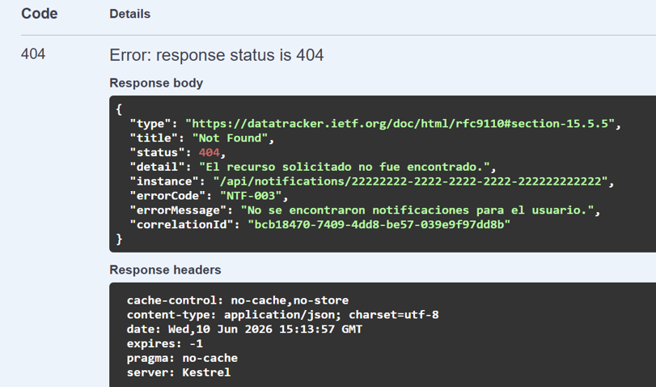

**Error NTF-004 (Error Interno al procesar la notificación):**
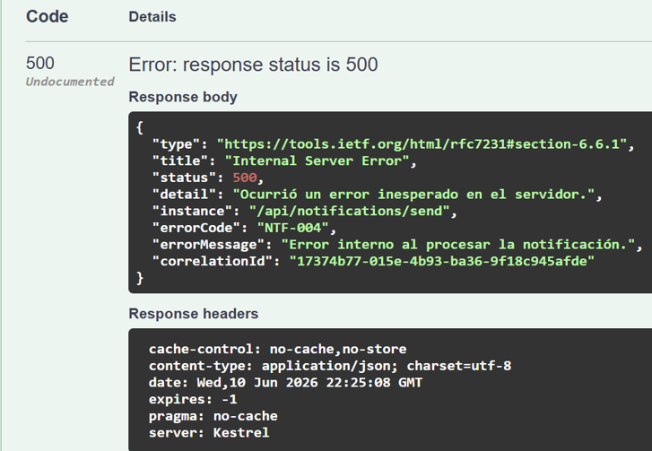

---